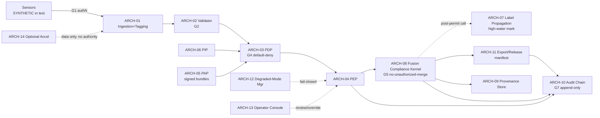

# 04 — Software Architecture and Trust Boundaries

Owner: `fce-lead-systems-architect`. Reviewed under `fce-secure-architecture-review`.

## Architecture elements

| ID | Element | Responsibility |
|---|---|---|
| ARCH-01 | Ingestion and Metadata Tagging Service | Accept sensor-derived objects; bind mandatory metadata; entry PEP (G1) |
| ARCH-02 | Metadata Validator | Schema and completeness validation; fail closed on missing or malformed (G2) |
| ARCH-03 | Policy Decision Point (PDP) | Deterministic, default-deny evaluation against signed bundle (G4) |
| ARCH-04 | Policy Enforcement Points (PEP) | Apply PDP disposition at each gate |
| ARCH-05 | Policy Administration Point (PAP) and Bundle Store | Signed, versioned policy bundles; hot-reload with rollback |
| ARCH-06 | Policy Information Point (PIP) | Supply attributes: mission, user, sensor, classification, domain, caveat, time, network state |
| ARCH-07 | Label Propagation Engine | High-water-mark labelling for merged and derived objects. Pure function invoked only by ARCH-08 post-permit (C1, 2026-07-06): executes in ARCH-08's trust domain; deterministic; side-effect-free (no I/O, no state); invocable by no component other than ARCH-08. ARCH-08 via ARCH-07 is the single writer of output labels. |
| ARCH-08 | Fusion Compliance Kernel | Deterministic gate around fusion; no-unauthorized-merge (G5) |
| ARCH-09 | Provenance and Lineage Graph Store | Record and preserve provenance and parent linkage |
| ARCH-10 | Audit Chain Writer | Append-only, hash-chained audit records (G7) |
| ARCH-11 | Export and Release Controller | Release/export with integrity manifest |
| ARCH-12 | Degraded-Mode Manager | Detect resource constraints; enforce fail-closed posture |
| ARCH-13 | Operator Console | Explanation, review queue, controlled override |
| ARCH-14 | Optional Vision-Acceleration Preprocessing | EO/IR preprocessing candidate; OUTSIDE the compliance-decision path |

## Trust boundaries (zero-trust) [FACT — invariant from `_SHARED_CONSTRAINTS.md`]

Every pair below is mutually untrusted until authenticated and authorized:

- Sensor sources to ARCH-01 (source authentication at G1).
- Service to service (ARCH-01…ARCH-13): mutual authN/authZ on every call.
- Operator to ARCH-13 (authenticated identity; authority for override).
- Policy bundle to ARCH-03/ARCH-05 (signature verification before load).
- PIP attributes to PDP (ARCH-06 to ARCH-03): every attribute authenticated and
  integrity-bound to a trusted source; unverifiable attributes fail closed at G4
  (RC-008). Attribute provenance is a first-class trust boundary. [B1]
- Object binding state to the FCE (ARCH-01): `policy_binding_state` is set only
  by the FCE and forced to `unvalidated` at G1; it is never trusted from source
  input. [B3]
- Audit store to all writers (append-only; no delete/update path).
- ARCH-14 accelerator to core: data-only handoff; never a decision authority.
- Update mechanism to any element (signed, verified, rollback-capable).
- ARCH-07 to ARCH-08 (C1): ARCH-07 is in-kernel — its code integrity is
  kernel integrity; the former service-pair boundary is collapsed to a
  caller/callee contract with the four stated properties.
- ARCH-09 fusion parent-link records (C2): writable only by ARCH-08.
  Kernel-only write authority for fusion linkage is an explicit trust
  boundary; the G5-entry cross-check depends on it.

## Deployment view [ASSUMPTION — pending OPEN-03]

Target is an edge-class compute node (Jetson-class assumed) plus optional
higher-side services for cross-domain routing. Degraded-mode posture applies at
the edge. All numbers are TARGET until measured.

## Trust-boundary diagram (described text / Mermaid)

Each arrow crossing a component is a trust boundary with an authN/authZ story
(detailed per interface in `10` and gated in `99`).

## Secure-architecture lenses (summary; full pass in `99`)

Trust boundaries enumerated; attack surfaces have authN/authZ stories; defaults
are deny-by-default and fail-closed; policy reload versus in-flight objects is
version-pinned (see `07`); enforcement is deterministic; no path may skip the
seven gates (`05`), including debug, admin, replay, and accelerated paths;
every decision emits audit; degraded mode is fail-closed.

## Facts / Assumptions / Judgment / Uncertainty

- Facts: zero-trust invariant; gate-ordering requirement.
- Assumptions: edge deployment target and topology (OPEN-03).
- Judgment: the 14-element decomposition and boundary placement; ARCH-07 pure-function demotion (C1, M5 Sprint 9).
- Uncertainty: final topology of higher-side cross-domain services.
