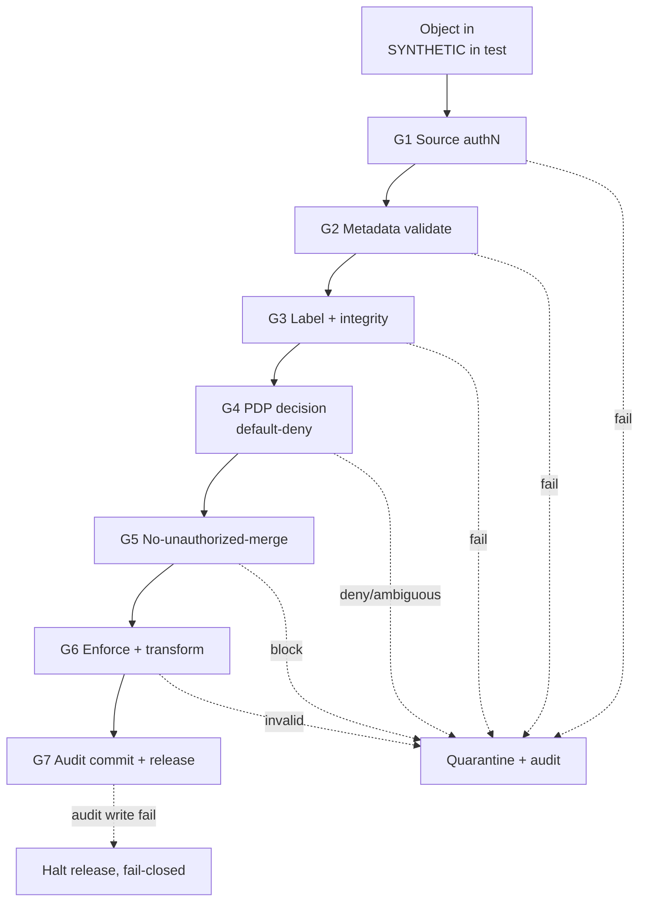

# 05 — Seven-Gate Data Flow

Owner: `fce-lead-systems-architect` with `sensor-fusion-engineer`.
Reviewed under `fce-secure-architecture-review` (lens 6: no gate bypass).

## Principle

Every object traverses all seven gates in order, from ingestion to fusion to
audit and release. No path may skip any gate, including debug, admin, replay,
and accelerated (GPU) paths. Every gate fails closed and emits an audit event.

## Gate table

| Gate | Name | Pass condition | Fail-closed behaviour | Audit event class |
|---|---|---|---|---|
| G1 | Ingestion authentication and source verification | Source authenticated; object signature (if present) verified | Reject/quarantine unverifiable source | ingestion |
| G2 | Metadata completeness and schema validation | All 15 mandatory metadata fields present and well-formed | Reject object missing or malformed metadata | ingestion |
| G3 | Classification, domain, and caveat resolution and integrity | Labels valid in project taxonomy; integrity hash matches; timestamp fresh | Quarantine on invalid/expired/ambiguous label | transformation |
| G4 | Policy decision (PDP) | PDP returns an explicit permit or restriction under default-deny | Deny/quarantine; enqueue human review on ambiguity | policy decision |
| G5 | Cross-domain merge / no-unauthorized-merge | Fusion association has an explicit permit; high-water-mark labelling applied | Block merge; segregate inputs | fusion decision |
| G6 | Enforcement and transformation action | Disposition applied (transform, route, downgrade-with-proof, quarantine) | Fail closed if action or authority invalid | routing / quarantine / downgrade |
| G7 | Audit commit and release/export control | Audit record appended to chain; export manifest generated if releasing | Halt release if audit write fails (audit loss = fail-closed) | export / override |

## Ordered flow (described text / Mermaid)

## Fusion handoff [ENGINEERING JUDGMENT]

AI-assisted association and confidence scoring feed G5 as advisory inputs only.
The Fusion Compliance Kernel (ARCH-08) makes the deterministic merge decision.
Confidence is recorded (advisory) but is never the sole pass/fail authority.

## Accelerated-path constraint

If the optional accelerator (ARCH-14) preprocesses EO/IR data, its output still
enters at G1 and traverses G1 through G7 unchanged. The accelerator holds no
decision authority and cannot shortcut any gate (see `13`).

## Requirement trace

G1 to FCE-REQ-ING-010; G2 to FCE-REQ-MET-010; G3 to FCE-REQ-POL-011; G4 to
FCE-REQ-KRN-001, FCE-REQ-POL-012; G5 to FCE-REQ-KRN-010; G6 to FCE-REQ-OPS-002
(override/downgrade); G7 to FCE-REQ-AUD-001, FCE-REQ-EXP-001.

## Facts / Assumptions / Judgment / Uncertainty

- Facts: fail-closed at each gate; audit on every gate; no-bypass rule.
- Assumptions: the seven-gate granularity is sufficient for all modalities.
- Judgment: gate ordering and the placement of the fusion handoff at G5.
- Uncertainty: whether cross-domain routing needs a distinct sub-gate.
