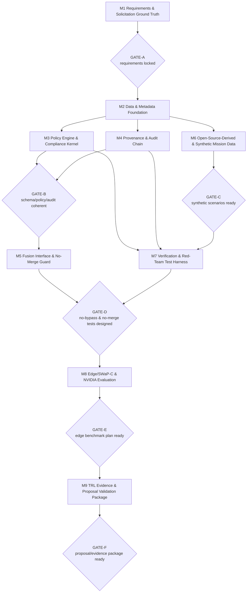
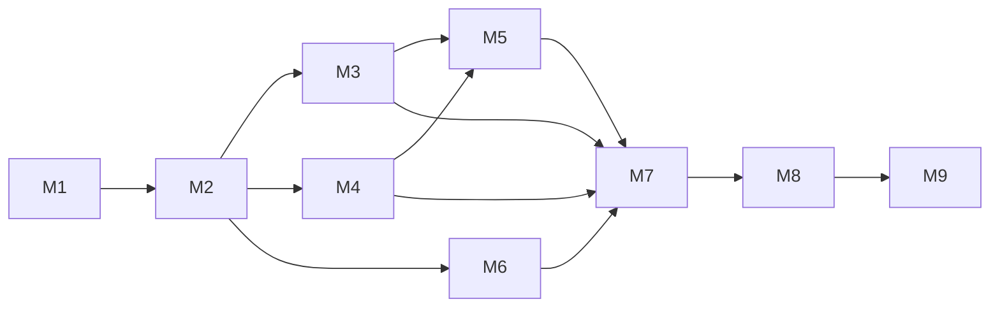

# 14 — Execution Architecture (Mission Blocks M1–M9)

Owner: `fce-lead-systems-architect`. Execution planning artifact.
Source of truth: `docs/00`–`13`, `97`, `98`. This file plans *how* the FCE is
built and evidenced. TRL 1-3 includes design plus a minimal executable PoC;
`16` defines the proof discipline for that PoC: source reconstruction, pre-code
decisions, sealed evidence, guard tests, open-source data trimming, code
correctness, and separate held-out laptop validation. Production, operational,
classified-processing, deployment, external installs, and measured-performance
claims remain out of scope (see `12` TRL bands).

All performance goals are TARGET (internal, to be verified on named hardware).
No certification, accreditation, ATO, endorsement, classified-processing, or
measured-performance claim is made. B1–B3 are closed-in-text (see `97`); H1–H14
remain open maturity items (see `98`).

## 1. Direct objective

This file converts the FCE system architecture (`04`–`13`) into a mission-block
execution plan (M1–M9) that carries the design from requirements ground truth to
a TRL evidence and proposal-validation package. Each block is a scoped unit of
work with inputs, two planning/build sprints, outputs, acceptance criteria,
requirement traces, verification methods, risks, and an exit gate. The blocks
are sequenced by review gates GATE-A through GATE-F so that no downstream build
starts before its upstream design is coherent and locked.

## 2. Mission-block flowchart

## 3. Mission blocks

### M1 — Requirements and Solicitation Ground Truth
- Objective: lock the outcome registry and RTM against the verbatim solicitation.
- Why it exists: the RTM anchors everything; M1 Sprint 1 replaced the original
  paraphrased anchors with verified verbatim Canada.ca outcome text. M1 Sprint 2
  must still audit coverage before GATE-A is declared.
- Inputs: `02`, `03`, `00` (OPEN-01/02), DND solicitation text (pending).
- Sprint 1: obtain and quote verbatim solicitation; replace anchors in `02`/`03`.
- Sprint 2: finalize RTM rows, acceptance criteria, and coverage audit (6/6, 4/4).
- Outputs: finalized RTM; outcome-to-capability map; coverage report.
- Acceptance criteria: every outcome quoted with citation; every requirement has
  ID, verification method, acceptance criterion; DES-01 and DES-03 present.
- Requirement IDs touched: FCE-ESS-01…06, FCE-DES-01…04; all FCE-REQ-* rows.
- Verification method: inspection, analysis.
- Risks: solicitation text unavailable or versioned (OPEN-01) blocks finalization.
- Exit gate: GATE-A.

### M2 — Data and Metadata Foundation
- Objective: freeze the 15-field object metadata schema and implement PoC schema
  validation.
- Why it exists: every gate and policy rule consumes this schema; it must be
  stable before policy/audit/fusion build.
- Inputs: `06`, `04` (ARCH-01/02/09), M1 requirements.
- Sprint 1: confirm 15-field schema, taxonomy mapping (OPEN-02), fail-closed at G2.
- Sprint 2: implement minimal local schema-validation PoC and tests for valid
  object, missing mandatory field, malformed metadata, and source-supplied
  `policy_binding_state`.
- Outputs: schema v1, provenance model, validation rules, schema-validation PoC,
  validation test output.
- Acceptance criteria: mandatory-field rejection specified; `policy_binding_state`
  FCE-authority-set only (B3); provenance fields cover FCE-ESS-04.
- Requirement IDs touched: FCE-REQ-MET-010, FCE-REQ-PRV-001/002, FCE-REQ-POL-011.
- Verification method: inspection, unit test, analysis.
- Risks: coalition caveat sub-fields may be missing (uncertainty in `06`).
- Exit gate: contributes to GATE-B.

### M3 — Policy Engine and Compliance Kernel
- Objective: design and implement a minimal deterministic, default-deny
  PDP/PEP/PAP/PIP PoC.
- Why it exists: this is the compliance authority; determinism and fail-closed are
  non-negotiable.
- Inputs: `07`, M2 schema, B1/B2 closures (`97`).
- Sprint 1: PDP evaluation model, 11 actions, reason codes (incl. RC-008),
  deny-overrides, PIP attribute authentication (B1).
- Sprint 2: implement a small machine-readable policy fixture and local policy
  evaluator that returns permit/restrict/block/quarantine/review decisions for
  synthetic objects.
- Outputs: policy model v1, rule examples, PIP authentication spec, policy
  evaluator PoC, determinism and red-team test output.
- Acceptance criteria: default-deny everywhere; ties fail closed; B1 fail-closed at
  G4 on unverifiable PIP attribute; B2 override cannot relax the merge invariant.
- Requirement IDs touched: FCE-REQ-POL-001/011/012/020, FCE-REQ-KRN-001/002/010,
  FCE-REQ-SEC-001.
- Verification method: unit test, property-based test, red-team test.
- Risks: nondeterministic conflict outcomes (escalate; interim fail-closed).
- Exit gate: contributes to GATE-B.

### M4 — Provenance and Audit Chain
- Objective: design and implement minimal provenance and audit-log emission.
- Why it exists: total auditability and replay are Essential outcomes (ESS-04/05/06).
- Inputs: `08`, M2 provenance model, M3 decision fields.
- Sprint 1: 18-field schema, 9 event classes, chain + replay determinism.
- Sprint 2: implement local JSONL audit emission and provenance parent-link
  capture for accepted, rejected, transformed, and fused synthetic objects.
- Outputs: audit schema v1, export/manifest spec, replay spec, audit writer PoC,
  sample JSONL audit/provenance outputs.
- Acceptance criteria: 1:1 decision-to-audit; chain tamper-evident (design); replay
  reproduces dispositions; audit loss halts release at G7.
- Requirement IDs touched: FCE-REQ-AUD-001/002/003, FCE-REQ-EXP-001, FCE-REQ-PRV-001/002.
- Verification method: integration test, property-based test, red-team test.
- Risks: tamper-evidence rests on placeholder crypto until H6 closes.
- Exit gate: contributes to GATE-B.

### M5 — Fusion Interface and No-Merge Guard
- Objective: design and implement the minimal Fusion Compliance Kernel (G5) and
  no-unauthorized-merge PoC.
- Why it exists: cross-domain merge is the highest-impact leak path; the invariant
  must be structurally enforced.
- Inputs: `05` (G5), `07` invariant, M3 policy, M4 audit.
- Sprint 1: high-water-mark propagation, explicit-permit merge check, segregation on block.
- Sprint 2: implement local merge evaluation over two or more synthetic parent
  objects, including permitted same-domain merge and blocked cross-domain merge.
- Outputs: fusion-kernel interface spec, merge decision model, propagation rules,
  no-unauthorized-merge PoC evidence.
- Acceptance criteria: no merge without covering permit; override cannot relax the
  invariant; derived objects carry high-water-mark labels and parent linkage.
- Requirement IDs touched: FCE-REQ-KRN-010, FCE-REQ-POL-012, FCE-REQ-OPS-002.
- Verification method: property-based test, red-team test.
- Risks: THR-KRN-001 blocking-until-verified until H9 tests pass.
- Exit gate: contributes to GATE-D.

### M6 — Open-Source-Derived and Synthetic Mission Data
- Objective: finalize and materialize approved open-source-derived fixtures,
  synthetic red-team variants, and expected dispositions used by the PoC.
- Why it exists: DND provides no data; the laptop proof needs public source
  provenance plus controlled synthetic conflicts to exercise every gate/action.
- Inputs: `09`, M2 schema, M3 policy actions.
- Sprint 1: scenario specs (Joint ISR, Maritime, Tactical Edge, UAV) with embedded conflicts.
- Sprint 2: create local open-source-derived fixture files for at least two
  approved source families, split into calibration and held-out sets, plus
  synthetic red-team variants (tampered, malformed, stale, PIP spoofing,
  pre-marking, unauthorized merge attempt).
- Outputs: scenario library, source manifest, trim report, calibration fixture
  set, held-out fixture set, expected-decision tables, red-team data specs.
- Acceptance criteria: every gate and every policy action exercised; all objects
  labelled `PUBLIC-OPEN-SOURCE`, `SYNTHETIC-DERIVED`, or `SYNTHETIC`; "-like"
  discipline; project taxonomy only; held-out fixture seal ready for M7.
- Requirement IDs touched: FCE-REQ-ING-010, FCE-REQ-POL-011/012, FCE-REQ-KRN-010.
- Verification method: simulation, inspection.
- Risks: unrepresentative scenarios (THR-SIM-001) give false confidence.
- Exit gate: GATE-C.

### M7 — Verification and Red-Team Test Harness
- Objective: implement/run the requirement-linked V&V system across core PoC
  test classes.
- Why it exists: closes the requirement→evidence loop and demonstrates B1–B3 at
  PoC feasibility level.
- Inputs: `03` RTM, `07`/`08` test descriptions, `09` scenarios, `98` conditions.
- Sprint 1: test matrix (unit, integration, property-based, explainability) with
  bidirectional trace.
- Sprint 2: implement/run a minimal test harness including PIP spoofing (B1),
  override-over-merge (B2), pre-marking (B3), no-bypass, no-unauthorized-merge
  (H9), and fail-closed cases per gate.
- Outputs: V&V matrix, red-team test specs, runnable PoC test harness, coverage
  report (n/total, gaps), sample test output.
- Acceptance criteria: every requirement has ≥1 test; all 10 red-team categories present;
  fail-closed case per gate; no expected result depends solely on AI output.
- Requirement IDs touched: all FCE-REQ-* (verification coverage).
- Verification method: unit / integration / property-style / red-team /
  regression / explainability.
- Risks: untestable requirements return to M1; live operational, private, controlled, or classified data disallowed; public open-source-derived fixtures and synthetic variants only.
- Exit gate: contributes to GATE-D.

### M8 — Edge/SWaP-C and NVIDIA Evaluation
- Objective: design the edge benchmark plan and the optional NVIDIA evaluation track.
- Why it exists: Desired outcomes DES-01/DES-03 (tactical latency, SWaP/compute limits).
- Inputs: `12`, `13`, `04` deployment view (OPEN-03), M7 harness.
- Sprint 1: metric set (per-gate + end-to-end latency, throughput, memory, CPU/GPU,
  thermal, power) all labelled TARGET; six degraded-mode classes; fail-closed per class.
- Sprint 2: baseline-vs-candidate protocol on named hardware; NVIDIA decision records
  (DR-001…007) kept OUTSIDE the compliance path; accelerated path re-enters G1.
- Outputs: benchmark plan (TARGET), degraded-mode protocol, NVIDIA decision records.
- Acceptance criteria: every figure labelled TARGET or MEASURED(provenance); baseline
  symmetric and named-hardware; no vendor figure repeated as fact; NVIDIA never in the
  compliance authority path.
- Requirement IDs touched: FCE-REQ-EDG-001 (TARGET), FCE-REQ-EDG-010.
- Verification method: benchmark, edge/degraded test (designs; execution post-approval).
- Risks: hardware SKU unconfirmed (OPEN-03) keeps figures TARGET; vendor lock-in/CUDA
  (see `13`).
- Exit gate: GATE-E.

### M9 — TRL Evidence and Proposal Validation Package
- Objective: assemble the TRL evidence pack and the proposal compliance matrix.
- Why it exists: converts artifacts into traceable evidence and proposal-safe language.
- Inputs: `12`, all prior outputs, `98`/`97` review status, positioning baseline (`01`).
- Sprint 1: evidence index (EVD-*) per TRL band; TRL exit-criteria gap audit.
- Sprint 2: compliance matrix (clause→evidence), claim screen, red-team claim audit,
  website-safe/proposal-safe language.
- Outputs: evidence pack, compliance matrix, proposal-ready sections (labelled).
- Acceptance criteria: every claim traces to an existing artifact; ESS 6/6, DES 4/4;
  zero prohibited-claim instances; accreditation-support labelled "support" only.
- Requirement IDs touched: all FCE-REQ-* (coverage roll-up).
- Verification method: accreditation-support review (labelled support), inspection.
- Risks: evidence gaps become claim gaps; pressure to overclaim (escalate).
- Exit gate: GATE-F.

## 4. TRL mapping

| Block | TRL 1-3 (design + PoC) | TRL 4-5 (lab/relevant, synthetic) | TRL 6-9 (relevant/operational demo) |
|---|---|---|---|
| M1 | Lock RTM and outcomes | RTM stable under test feedback | RTM maintained through demo |
| M2 | Schema/provenance design + validation PoC | Harden schema + broader tests | Hardened schema in integrated demo |
| M3 | Policy model + evaluator PoC | Expand PDP + property/red-team tests | Hot-reload demo without restart |
| M4 | Audit/lineage design + JSONL audit PoC | Harden chain + replay tests | Full export + lineage demo |
| M5 | Fusion-guard design + no-merge PoC | No-merge invariant demonstrated at lab scale | Cross-domain demo under load |
| M6 | Scenario specs + open-source-derived/synthetic fixtures | Scenarios drive lab tests | Representative-environment scenarios |
| M7 | V&V design + minimal test harness run | Execute expanded unit/integration/property/red-team | Regression + field/integration tests |
| M8 | Benchmark plan (TARGET) | Measured on named rig (provenance) | Sustained edge demo; NVIDIA eval outcome |
| M9 | Evidence structure | Test-log evidence assembled | Accreditation-support package (labelled) |

## 5. Dependency map

- M1 precedes all blocks (requirements ground truth).
- M2 precedes M3, M4, M5, M6.
- M3 and M4 precede M5 and M7.
- M6 precedes M7 (scenarios feed tests).
- M5 precedes M7 (fusion guard must exist to test no-merge).
- M7 precedes M8 (harness before benchmarking) and M9.
- M8 precedes M9 (benchmark/eval evidence feeds the package).

## 6. Review gates

| Gate | Meaning | Entry condition | Blocks gated |
|---|---|---|---|
| GATE-A | Requirements locked | Verbatim solicitation quoted; RTM 6/6 + 4/4; DES-01/DES-03 present | after M1 |
| GATE-B | Schema/policy/audit architecture coherent | M2 schema frozen + validation PoC; M3 default-deny + B1/B2 policy PoC; M4 audit/provenance PoC consistent | after M2, M3, M4 |
| GATE-C | Laptop fixtures ready | Public-source manifest, trim report, calibration/held-out split, fixture seal, and synthetic red-team variants exercise every gate/action | after M6 |
| GATE-D | No-bypass and no-unauthorized-merge PoC evidence ready | M5 guard PoC + M7 red-team harness evidence for B1–B3, no-bypass, no-merge (H9) | after M5, M7 |
| GATE-E | Edge benchmark plan ready | M8 metrics labelled TARGET; degraded-mode 6 classes; baseline symmetric; NVIDIA outside compliance path | after M8 |
| GATE-F | Proposal/evidence package ready | M9 evidence traces exist; claim screen clean; ESS 6/6 DES 4/4; no prohibited vocabulary | after M9 |

Maturity note: GATE-D and beyond depend on the open high-priority items H1–H14
(`98`) — especially H9 (demonstrate B1–B3, no-bypass, no-merge by test), H4
(trusted time), H6 (crypto root-of-trust/key management), H7/H8 (audit ordering,
cross-object bundle version). B1–B3 are closed-in-text (`97`) but not yet
closed-by-test.

## 7. Facts / Assumptions / Judgment / Uncertainty

- Facts: block-to-requirement traces, gate definitions, and TRL bands are drawn
  from `03`, `05`, `07`, `08`, `12`, `13`, `97`, `98`.
- Assumptions: solicitation text arrives to clear GATE-A (OPEN-01); named edge
  hardware becomes available for M8 measurement (OPEN-03).
- Judgment: the M1–M9 decomposition, sprint split, PoC boundary, and gate
  placement are the architect's execution-planning choices, not DND requirements.
- Uncertainty: sprint sizing and sequencing may shift after GATE-A; all
  performance goals remain TARGET until measured on named hardware.
