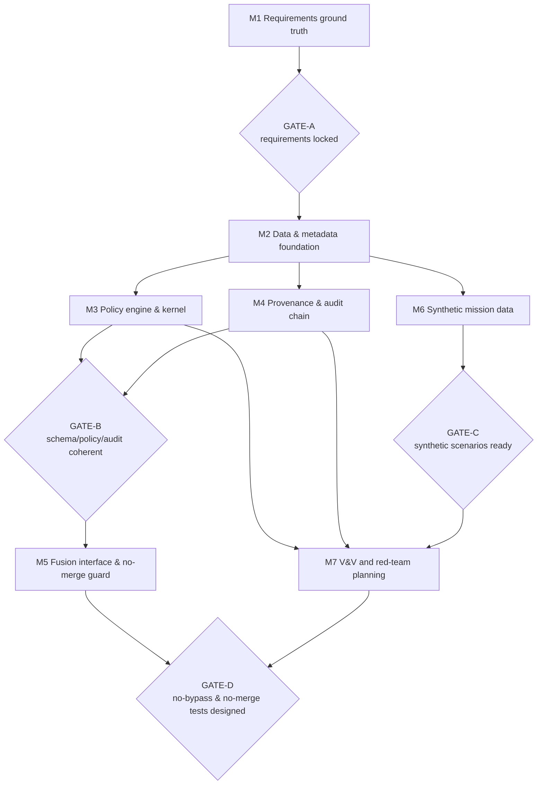

# 15 — TRL 1-3 Build Plan

Owner: `fce-lead-systems-architect` with `trl-evidence-engineer`. Docs-only.
Source of truth: `docs/00`–`14`, `97`, `98`. Scope is **TRL 1-3 only**
(basic principles → analytical proof of concept). TRL 4-5 and TRL 6-9 are not
planned in detail here.

TRL 1-3 rule: **no implementation code is produced.** Every block delivers a
design/specification artifact (Sprint 1) and an analysis/review/evidence artifact
(Sprint 2). All performance goals are TARGET. No certification, accreditation,
ATO, endorsement, classified-processing, or measured-performance claim is made.
B1–B3 are closed-in-text (`97`); H1–H14 are open maturity items (`98`).

## Blocks in scope

M1 Requirements and Solicitation Ground Truth · M2 Data and Metadata Foundation ·
M3 Policy Engine and Compliance Kernel · M4 Provenance and Audit Chain ·
M5 Fusion Interface and No-Merge Guard · M6 Synthetic Mission Data and Simulation ·
M7 Verification and Red-Team Test Harness Planning.

---

## M1 — Requirements and Solicitation Ground Truth
1. Objective: lock the outcome registry and RTM against verbatim solicitation text.
2. TRL 1-3 purpose: establish the analytical ground truth every other block traces to.
3. Sprint 1 (design/spec): quote verbatim solicitation; replace anchors in `02`/`03`; draft finalized RTM rows.
4. Sprint 2 (analysis/review/evidence): coverage audit (ESS 6/6, DES 4/4; DES-01/DES-03 present); requirements-traceability review; capture coverage report as evidence.
5. Artifacts to create: finalized RTM (`03` update), outcome-to-capability map, coverage report.
6. Analysis or tests to design: gap analysis outcome→capability→requirement; verification-method assignment review.
7. Evidence to capture: EVD — coverage report, RTM baseline, citation list.
8. Definition of done: every outcome quoted + cited; every requirement has ID, verification method, acceptance criterion; no unsupported claim in any row.
9. Requirement IDs touched: FCE-ESS-01…06, FCE-DES-01…04; all FCE-REQ-* rows.
10. Dependencies: none (root block); needs solicitation text (OPEN-01).
11. Risks: solicitation text unavailable or version-uncertain blocks GATE-A.
12. Exit gate: GATE-A (requirements locked).

## M2 — Data and Metadata Foundation
1. Objective: freeze the 15-field object metadata schema and provenance model.
2. TRL 1-3 purpose: provide the stable data contract that policy/audit/fusion design depends on.
3. Sprint 1 (design/spec): confirm 15-field schema (`06`), taxonomy mapping (OPEN-02), B3 authority-set binding-state rules, fail-closed at G2.
4. Sprint 2 (analysis/review/evidence): data-model review; provenance/lineage node model analysis; capture schema-freeze decision record.
5. Artifacts to create: schema v1 (design), provenance model spec, validation-rule list, DR for schema freeze.
6. Analysis or tests to design: field-completeness analysis; high-water-mark propagation analysis; unit-test descriptions for schema validation (no code).
7. Evidence to capture: EVD — schema-freeze DR, provenance model, validation-rule table.
8. Definition of done: mandatory-field rejection specified; `policy_binding_state` FCE-authority-set only (B3); provenance covers FCE-ESS-04.
9. Requirement IDs touched: FCE-REQ-MET-010, FCE-REQ-PRV-001/002, FCE-REQ-POL-011.
10. Dependencies: M1 (requirements).
11. Risks: coalition caveat sub-fields may be missing (uncertainty in `06`).
12. Exit gate: contributes to GATE-B.

## M3 — Policy Engine and Compliance Kernel
1. Objective: complete the deterministic, default-deny policy model design (PDP/PEP/PAP/PIP).
2. TRL 1-3 purpose: prove on paper that enforcement is deterministic, fail-closed, and auditable.
3. Sprint 1 (design/spec): PDP evaluation model, 11 actions, reason codes (incl. RC-008), deny-overrides, PIP attribute authentication (B1), override envelope (B2); Rego-style example rules.
4. Sprint 2 (analysis/review/evidence): determinism analysis; conflict-resolution walkthrough; secure-architecture review of the policy path; unit-test descriptions.
5. Artifacts to create: policy model v1 (`07` basis), rule examples, PIP-auth spec, unit-test descriptions, review report.
6. Analysis or tests to design: property-based test descriptions (determinism, default-deny); red-team test descriptions (PIP spoofing, override-over-merge).
7. Evidence to capture: EVD — policy review report, rule set, test descriptions.
8. Definition of done: default-deny everywhere; ties fail closed; B1 fail-closed at G4 on unverifiable PIP attribute; B2 override cannot relax the merge invariant.
9. Requirement IDs touched: FCE-REQ-POL-001/011/012/020, FCE-REQ-KRN-001/002/010, FCE-REQ-SEC-001.
10. Dependencies: M1, M2.
11. Risks: nondeterministic conflict outcome (escalate; interim fail-closed).
12. Exit gate: contributes to GATE-B.

## M4 — Provenance and Audit Chain
1. Objective: complete the 18-field, hash-chained, append-only audit and lineage export design.
2. TRL 1-3 purpose: prove analytically that every decision is reconstructible and tamper-evident (design-level).
3. Sprint 1 (design/spec): 18-field schema (`08`), 9 event classes, chain + replay determinism, export/manifest.
4. Sprint 2 (analysis/review/evidence): replay-determinism analysis; overflow fail-closed review; signature-placeholder discipline check; unauthenticated-rejection audit event note (H14 forward-link).
5. Artifacts to create: audit schema v1, export/manifest spec, replay spec, review report.
6. Analysis or tests to design: property-based test descriptions (chain integrity, replay); red-team test descriptions (chain rewrite).
7. Evidence to capture: EVD — audit schema, replay analysis, review report.
8. Definition of done: 1:1 decision-to-audit; chain tamper-evident (design); replay reproduces dispositions; audit loss halts release at G7; no crypto-cert claim.
9. Requirement IDs touched: FCE-REQ-AUD-001/002/003, FCE-REQ-EXP-001, FCE-REQ-PRV-001/002.
10. Dependencies: M2 (provenance), M3 (decision fields).
11. Risks: tamper-evidence rests on placeholder crypto until H6 closes.
12. Exit gate: contributes to GATE-B.

## M5 — Fusion Interface and No-Merge Guard
1. Objective: complete the Fusion Compliance Kernel (G5) and no-unauthorized-merge design.
2. TRL 1-3 purpose: prove the merge invariant is structurally enforced (analysis-level).
3. Sprint 1 (design/spec): high-water-mark propagation, explicit-permit merge check, segregation-on-block, fusion-kernel interface.
4. Sprint 2 (analysis/review/evidence): invariant walkthrough; override-envelope interaction (B2); sole-fusion-authority analysis (H1 forward-link); red-team test descriptions.
5. Artifacts to create: fusion-kernel interface spec, merge decision model, propagation rules, invariant analysis.
6. Analysis or tests to design: property-based test descriptions (no merge without permit); red-team test descriptions (forced merge, override-over-merge).
7. Evidence to capture: EVD — invariant analysis, fusion-kernel spec, test descriptions.
8. Definition of done: no merge without covering permit (design); override cannot relax invariant; derived objects carry high-water-mark labels + parent linkage.
9. Requirement IDs touched: FCE-REQ-KRN-010, FCE-REQ-POL-012, FCE-REQ-OPS-002.
10. Dependencies: M3, M4.
11. Risks: THR-KRN-001 remains blocking-until-verified until H9 tests (TRL 4-5).
12. Exit gate: contributes to GATE-D (tests designed).

## M6 — Synthetic Mission Data and Simulation
1. Objective: finalize the four synthetic scenario specifications and expected dispositions.
2. TRL 1-3 purpose: define, on paper, data that exercises every gate and policy action.
3. Sprint 1 (design/spec): scenario specs (Joint ISR, Maritime, Tactical Edge, UAV) with embedded conflicts (`09`).
4. Sprint 2 (analysis/review/evidence): red-team variants (tampered/malformed/stale); expected audit records; SYNTHETIC-labelling review.
5. Artifacts to create: scenario library (spec only), expected-decision tables, red-team data specs.
6. Analysis or tests to design: coverage analysis (every gate + action exercised); conflict-to-disposition mapping.
7. Evidence to capture: EVD — scenario specs, coverage matrix, labelling review.
8. Definition of done: every gate and policy action exercised somewhere; all objects labelled SYNTHETIC; "-like" discipline; project taxonomy only; specification-only (no data generated).
9. Requirement IDs touched: FCE-REQ-ING-010, FCE-REQ-POL-011/012, FCE-REQ-KRN-010.
10. Dependencies: M2 (schema), M3 (policy actions).
11. Risks: unrepresentative scenarios (THR-SIM-001) give false confidence.
12. Exit gate: GATE-C (synthetic scenarios ready).

## M7 — Verification and Red-Team Test Harness Planning
1. Objective: produce the requirement-linked V&V plan (test descriptions only, no execution).
2. TRL 1-3 purpose: design the verification system that will run at TRL 4-5; close the trace loop on paper.
3. Sprint 1 (design/spec): test matrix across classes (unit, integration, property-based, explainability) with bidirectional trace.
4. Sprint 2 (analysis/review/evidence): red-team suite design (10 categories) incl. B1/B2/B3, no-bypass, no-unauthorized-merge (H9); fail-closed cases per gate; coverage report.
5. Artifacts to create: V&V matrix, red-team test specs (descriptions), coverage report (n/total, gaps).
6. Analysis or tests to design: all test descriptions (no code); mapping of each requirement to ≥1 test.
7. Evidence to capture: EVD — V&V matrix, red-team specs, coverage report.
8. Definition of done: every requirement has ≥1 planned test; all 10 red-team categories present; fail-closed case per gate; no expected result depends solely on AI output.
9. Requirement IDs touched: all FCE-REQ-* (verification coverage).
10. Dependencies: M3, M4, M5, M6.
11. Risks: untestable requirements return to M1; live/real data disallowed (synthetic-first).
12. Exit gate: contributes to GATE-D (no-bypass and no-merge tests designed).

---

## TRL 1-3 Master Schedule

| Block | Sprint | Objective | Output | Review gate |
|---|---|---|---|---|
| M1 | S1 | Quote solicitation; draft finalized RTM | RTM rows (draft) | — |
| M1 | S2 | Coverage audit + traceability review | Coverage report | GATE-A |
| M2 | S1 | Freeze 15-field schema + provenance | Schema v1 (design) | — |
| M2 | S2 | Data-model review + freeze DR | Schema-freeze DR | GATE-B (partial) |
| M3 | S1 | Policy model + PIP-auth (B1) + override envelope (B2) | Policy model v1 | — |
| M3 | S2 | Determinism + secure-arch review | Policy review report | GATE-B (partial) |
| M4 | S1 | 18-field audit + chain + replay design | Audit schema v1 | — |
| M4 | S2 | Replay + overflow analysis | Audit review report | GATE-B (partial) |
| M5 | S1 | Fusion kernel + no-merge design | Fusion-kernel spec | — |
| M5 | S2 | Invariant + override-envelope analysis | Invariant analysis | GATE-D (partial) |
| M6 | S1 | Four scenario specs | Scenario library (spec) | — |
| M6 | S2 | Red-team variants + labelling review | Coverage matrix | GATE-C |
| M7 | S1 | V&V matrix (design) | V&V matrix | — |
| M7 | S2 | Red-team suite design + coverage | Coverage report | GATE-D (partial) |

GATE-B closes only when M2, M3, and M4 second sprints are all complete and
coherent. GATE-D closes only when M5 and M7 test designs are both complete.

## TRL 1-3 flowchart (M1–M7)

## What is intentionally deferred

Not part of TRL 1-3 (deferred to later bands or explicit approval):
- Implementation / source code of any block.
- Actual sensor adapters or ingestion connectors.
- Real DND-provided data.
- Any live, operational, controlled, or classified data.
- NVIDIA component installation (paper evaluation only; see `13`).
- Field or flight testing.
- Any accreditation or certification claim (accreditation-support labelled "support").
- Production cryptography (signatures/hashes remain design placeholders).
- TRL 4-5 execution (test implementation and measurement).

## Decision gates before TRL 4-5

All of the following must be satisfied before TRL 4-5 execution begins:
- Solicitation text finalized (verbatim, cited) — closes OPEN-01.
- RTM finalized (6/6 Essential, 4/4 Desired; every row testable).
- Schema frozen (15-field metadata + provenance model baselined).
- Policy model reviewed (deterministic, default-deny, B1/B2 confirmed).
- Audit model reviewed (18-field chain, replay determinism, overflow fail-closed).
- Synthetic scenario set approved (every gate/action exercised; SYNTHETIC labelled).
- V&V plan approved (every requirement has ≥1 planned test; 10 red-team categories).
- B1–B3 closed in text (`97`) — confirmed; test closure (H9) scheduled for TRL 4-5.
- H1–H14 triaged (owners and target band assigned; blocking items identified).
- No unsupported claims (red-team claim audit clean; no prohibited vocabulary).

## Facts / Assumptions / Judgment / Uncertainty

- Facts: block-to-requirement traces, gate definitions, and deferred-scope items
  are drawn from `03`, `05`, `07`, `08`, `09`, `12`, `13`, `14`, `97`, `98`.
- Assumptions: solicitation text arrives to clear GATE-A; two sprints per block
  are sufficient at analysis depth.
- Judgment: the sprint split (S1 design, S2 analysis/evidence) and gate placement
  are execution-planning choices, not DND requirements.
- Uncertainty: sprint sizing may change after GATE-A; all performance goals remain
  TARGET until measured at TRL 4-5 on named hardware.
